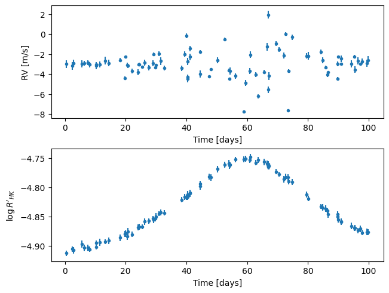
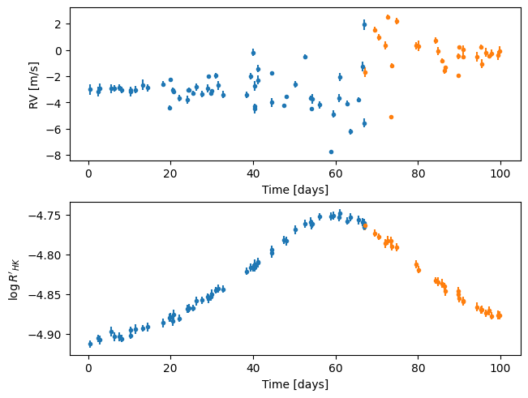
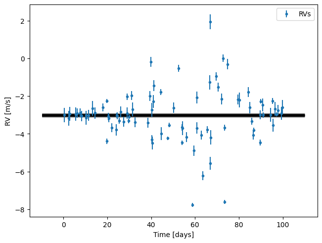
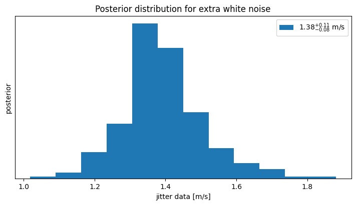
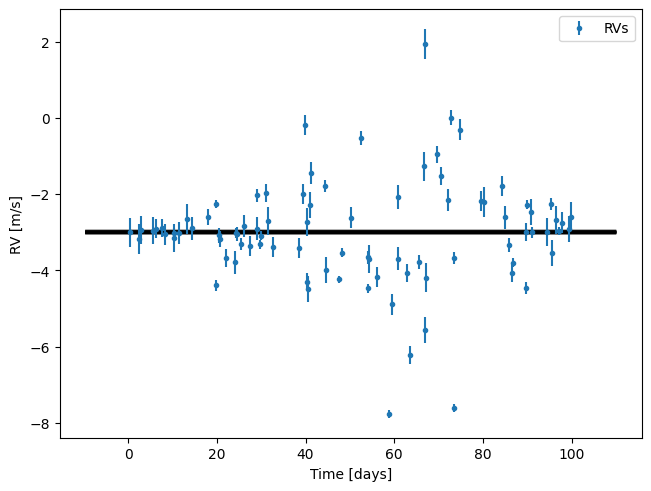
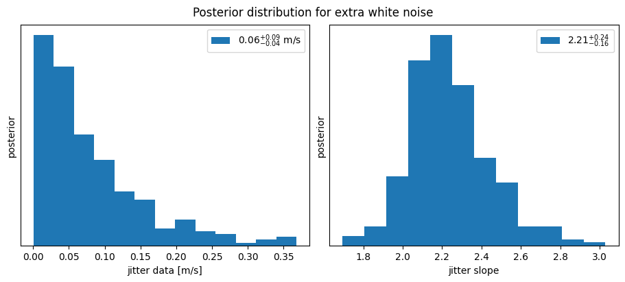

# Variable jitter

The RV dispersion is typically larger in more active stars.

To account for this, [Díaz et al.
(2016)](http://dx.doi.org/10.1051/0004-6361/201526729){:target="_blank"} proposed a model where
the 'jitter' term depends on the value of the $\log R'_{HK}$ indicator. Using
the same notation as in the [models](/docs/models) page, this changes the
default model in **kima** from

$$
v_i \sim \mathcal{N} \left( v_{sys} \,,\: j^2+\sigma_i^2 \right)
$$

to something like

$$
v_i \sim \mathcal{N} \left( v_{sys} \,,\: j^2 + (\alpha_j \cdot {\rm RHK})^2 + \sigma_i^2 \right)
$$

where ${\rm RHK}$ represents the values of $\log R'_{HK}$ normalized to the range $[0-1]$.

<div class="admonition note">
    <div class="admonition-title">Note</div>
    <p style="margin-top: 1em">
        The $\log R'_{HK}$ values are normalized to $[0-1]$
        by subtracting the minimun value and dividing by the peak-to-peak.
        This means that the additional white noise at the minimum $\log R'_{HK}$ value is zero.
    </p>
</div>

The parameter $\alpha_j$ is unknown and represents the slope of the dependence
of the jitter with $\log R'_{HK}$. We may assume that $\alpha_j>0$ always. This
model is implemented in [RVmodel](/docs/API/kima#RVmodel) with the
`jitter_propto_indicator` setting.

Let's see an example.

### Simulating a dataset

First, we get some standard imports out of the way


```python
import numpy as np
import matplotlib.pyplot as plt
import kima
from kima import keplerian
```

We'll generate a simple RV dataset that contains only noise. At the same time,
we also generate fake $\log R'_{HK}$ values which first increase slightly and
then decrease. This simulates the variation that could be observed due to a
stellar magnetic cycle.


```python
def create_data(multiple_instruments=False):
    np.random.seed(43) #(1)!

    t = np.sort(np.random.uniform(0, 100, 87)) #(2)! 

    #(3)!
    rv = np.random.normal(loc=-3, scale=0.01, size=t.size)  
    err_rv = np.random.uniform(0.1, 0.4, t.size)

    #(4)!
    rhk = -4.9 + keplerian(t, 300, 0.1, 0.5, 0.0, 0, 60)
    rhk = rhk + np.random.normal(loc=0.0, scale=0.003, size=t.size)  
    err_rhk = np.random.uniform(0.004, 0.006, t.size)
    # normalize the log R'HK to range [0, 1]
    norm_rhk = (rhk - rhk.min()) / np.ptp(rhk)

    mask = None
    if multiple_instruments: #(5)!
        mask = np.arange(t.size) > 2 * t.size // 3
        rv[mask] = rv[mask] + 2.5

    # !!! add jitter proportional to (normalized) log R'HK !!!
    alpha = 2.1
    rv = rv + np.random.normal(loc=0, scale=alpha * norm_rhk, size=t.size)

    # save the data in text files
    kw = dict(fmt='%10.5f', header='t rv err_rv rhk err_rhk')
    if multiple_instruments:
        D1 = np.c_[t[~mask], rv[~mask], err_rv[~mask], rhk[~mask], err_rhk[~mask]]
        D2 = np.c_[t[mask], rv[mask], err_rv[mask], rhk[mask], err_rhk[mask]]  
        np.savetxt('data1.txt', D1, **kw)
        np.savetxt('data2.txt', D2, **kw)
    else:
        D = np.c_[t, rv, err_rv, rhk, err_rhk]
        np.savetxt('data.txt', D, **kw)

    return (t, rv, err_rv, rhk, err_rhk, mask)
```

1. so you can reproduce the same dataset
2. random times over a short timespan
3. RVs with only white noise and associated uncertainties
4. simulate $\log R'_{HK}$ (using a Keplerian function just for convenience)
5. to simulate multiple instruments, add an RV offset to some points

Let's call the function and visualize the data


```python
t, rv, err_rv, rhk, err_rhk, mask = create_data()
```


```python
def plot_data(t, rv, err_rv, rhk, err_rhk, mask):
    fig, axs = plt.subplots(2, 1, constrained_layout=True)
    if mask is None:
        axs[0].errorbar(t, rv, err_rv, fmt='o', ms=3)
        axs[1].errorbar(t, rhk, err_rhk, fmt='o', ms=3)
    else:
        axs[0].errorbar(t[~mask], rv[~mask], err_rv[~mask], fmt='o', ms=3)
        axs[0].errorbar(t[mask], rv[mask], err_rv[mask], fmt='o', ms=3)
        axs[1].errorbar(t[~mask], rhk[~mask], err_rhk[~mask], fmt='o', ms=3)
        axs[1].errorbar(t[mask], rhk[mask], err_rhk[mask], fmt='o', ms=3)
    axs[0].set(xlabel='Time [days]', ylabel='RV [m/s]')
    axs[1].set(xlabel='Time [days]', ylabel="$\\log R'_{HK}$")
    return fig

plot_data(t, rv, err_rv, rhk, err_rhk, mask)
```


    

    


As we wanted, the variance of the RVs depends (linearly) on the $\log R'_{HK}$.
For the case of multiple instruments, the data looks very similar, except for
the added RV offset:


```python
plot_data(*create_data(multiple_instruments=True))
```


    

    


<div class="admonition note">
    <div class="admonition-title">Note</div>
    <p style="margin-top: 1em">
        With this very simple simulation, we are trying to reproduce the observed data of active stars.
        For example, compare the above with Fig. 9 from
        <a href="http://dx.doi.org/10.1051/0004-6361/201526729/">Díaz et al.(2016)</a>,
        showing HARPS data for HD40307:
    </p>
    <center>
    
    </center>
</div>

### A model with simple jitter

Let's now fit these data, assuming the usual model with a non-variable jitter term


```python
from kima import RVData, RVmodel, distributions
```


```python
data1 = RVData('data.txt')
model1 = RVmodel(fix=True, npmax=0, data=data1)
```

Run the model for a fewsteps


```python
kima.run(model1, steps=1000, num_threads=4, progress_bar=True)
```

    # Seeding random number generators. First seed = 1777457739.
    # Generating 4 particles from the prior...done.
    # Sampling...


    [                                                  ] 0%                                                  ] 0%                                                  ] 0%                                                  ] 0%                                                  ] 0%                                                  ] 0%                                                  ] 0%                                                  ] 0%                                                  ] 0%                                                  ] 0%                                                  ] 0%1%2%#                                                 ] 2%#                                                 ] 2%#                                                 ] 2%#                                                 ] 2%#                                                 ] 2%#                                                 ] 2%#                                                 ] 2%#                                                 ] 2%#                                                 ] 2%#                                                 ] 2%3%4%#                                                ] 4%#                                                ] 4%#                                                ] 4%#                                                ] 4%#                                                ] 4%#                                                ] 4%#                                                ] 4%#                                                ] 4%#                                                ] 4%#                                                ] 4%5%6%#                                               ] 6%#                                               ] 6%#                                               ] 6%#                                               ] 6%#                                               ] 6%#                                               ] 6%#                                               ] 6%#                                               ] 6%#                                               ] 6%#                                               ] 6%7%8%#                                              ] 8%#                                              ] 8%#                                              ] 8%#                                              ] 8%#                                              ] 8%#                                              ] 8%#                                              ] 8%#                                              ] 8%#                                              ] 8%#                                              ] 8%9%10%#                                             ] 10%#                                             ] 10%#                                             ] 10%#                                             ] 10%#                                             ] 10%#                                             ] 10%#                                             ] 10%#                                             ] 10%#                                             ] 10%#                                             ] 10%11%12%#                                            ] 12%#                                            ] 12%#                                            ] 12%#                                            ] 12%#                                            ] 12%#                                            ] 12%#                                            ] 12%#                                            ] 12%#                                            ] 12%#                                            ] 12%13%14%#                                           ] 14%#                                           ] 14%#                                           ] 14%#                                           ] 14%#                                           ] 14%#                                           ] 14%#                                           ] 14%#                                           ] 14%#                                           ] 14%#                                           ] 14%15%16%#                                          ] 16%#                                          ] 16%#                                          ] 16%#                                          ] 16%#                                          ] 16%#                                          ] 16%#                                          ] 16%#                                          ] 16%#                                          ] 16%#                                          ] 16%17%18%#                                         ] 18%#                                         ] 18%#                                         ] 18%#                                         ] 18%#                                         ] 18%#                                         ] 18%#                                         ] 18%#                                         ] 18%#                                         ] 18%#                                         ] 18%19%20%#                                        ] 20%#                                        ] 20%#                                        ] 20%#                                        ] 20%#                                        ] 20%#                                        ] 20%#                                        ] 20%#                                        ] 20%#                                        ] 20%#                                        ] 20%21%22%#                                       ] 22%#                                       ] 22%#                                       ] 22%#                                       ] 22%#                                       ] 22%#                                       ] 22%#                                       ] 22%#                                       ] 22%#                                       ] 22%#                                       ] 22%23%24%#                                      ] 24%#                                      ] 24%#                                      ] 24%#                                      ] 24%#                                      ] 24%#                                      ] 24%#                                      ] 24%#                                      ] 24%#                                      ] 24%#                                      ] 24%25%26%#                                     ] 26%#                                     ] 26%#                                     ] 26%#                                     ] 26%#                                     ] 26%#                                     ] 26%#                                     ] 26%#                                     ] 26%#                                     ] 26%#                                     ] 26%27%28%#                                    ] 28%#                                    ] 28%#                                    ] 28%#                                    ] 28%#                                    ] 28%#                                    ] 28%#                                    ] 28%#                                    ] 28%#                                    ] 28%#                                    ] 28%29%30%#                                   ] 30%#                                   ] 30%#                                   ] 30%#                                   ] 30%#                                   ] 30%#                                   ] 30%#                                   ] 30%#                                   ] 30%#                                   ] 30%#                                   ] 30%31%32%#                                  ] 32%#                                  ] 32%#                                  ] 32%#                                  ] 32%#                                  ] 32%#                                  ] 32%#                                  ] 32%#                                  ] 32%#                                  ] 32%#                                  ] 32%33%34%#                                 ] 34%#                                 ] 34%#                                 ] 34%#                                 ] 34%#                                 ] 34%#                                 ] 34%#                                 ] 34%#                                 ] 34%#                                 ] 34%#                                 ] 34%35%36%#                                ] 36%#                                ] 36%#                                ] 36%#                                ] 36%#                                ] 36%#                                ] 36%#                                ] 36%#                                ] 36%#                                ] 36%#                                ] 36%37%38%#                               ] 38%#                               ] 38%#                               ] 38%#                               ] 38%#                               ] 38%#                               ] 38%#                               ] 38%#                               ] 38%#                               ] 38%#                               ] 38%39%40%#                              ] 40%#                              ] 40%#                              ] 40%#                              ] 40%#                              ] 40%#                              ] 40%#                              ] 40%#                              ] 40%#                              ] 40%#                              ] 40%41%42%#                             ] 42%#                             ] 42%#                             ] 42%#                             ] 42%#                             ] 42%#                             ] 42%#                             ] 42%#                             ] 42%#                             ] 42%#                             ] 42%43%44%#                            ] 44%#                            ] 44%#                            ] 44%#                            ] 44%#                            ] 44%#                            ] 44%#                            ] 44%#                            ] 44%#                            ] 44%#                            ] 44%45%46%#                           ] 46%#                           ] 46%#                           ] 46%#                           ] 46%#                           ] 46%#                           ] 46%#                           ] 46%#                           ] 46%#                           ] 46%#                           ] 46%47%48%#                          ] 48%#                          ] 48%#                          ] 48%#                          ] 48%#                          ] 48%#                          ] 48%#                          ] 48%#                          ] 48%#                          ] 48%#                          ] 48%49%50%#                         ] 50%#                         ] 50%#                         ] 50%#                         ] 50%#                         ] 50%#                         ] 50%#                         ] 50%#                         ] 50%#                         ] 50%#                         ] 50%51%52%#                        ] 52%#                        ] 52%#                        ] 52%#                        ] 52%#                        ] 52%#                        ] 52%#                        ] 52%#                        ] 52%#                        ] 52%#                        ] 52%53%54%#                       ] 54%#                       ] 54%#                       ] 54%#                       ] 54%#                       ] 54%#                       ] 54%#                       ] 54%#                       ] 54%#                       ] 54%#                       ] 54%55%56%#                      ] 56%#                      ] 56%#                      ] 56%#                      ] 56%#                      ] 56%#                      ] 56%#                      ] 56%#                      ] 56%#                      ] 56%#                      ] 56%57%58%#                     ] 58%#                     ] 58%#                     ] 58%#                     ] 58%#                     ] 58%#                     ] 58%#                     ] 58%#                     ] 58%#                     ] 58%#                     ] 58%59%60%#                    ] 60%#                    ] 60%#                    ] 60%#                    ] 60%#                    ] 60%#                    ] 60%#                    ] 60%#                    ] 60%#                    ] 60%#                    ] 60%61%62%#                   ] 62%#                   ] 62%#                   ] 62%#                   ] 62%#                   ] 62%#                   ] 62%#                   ] 62%#                   ] 62%#                   ] 62%#                   ] 62%63%64%#                  ] 64%#                  ] 64%#                  ] 64%#                  ] 64%#                  ] 64%#                  ] 64%#                  ] 64%#                  ] 64%#                  ] 64%#                  ] 64%65%66%#                 ] 66%#                 ] 66%#                 ] 66%#                 ] 66%#                 ] 66%#                 ] 66%#                 ] 66%#                 ] 66%#                 ] 66%#                 ] 66%67%68%#                ] 68%#                ] 68%#                ] 68%#                ] 68%#                ] 68%#                ] 68%#                ] 68%#                ] 68%#                ] 68%#                ] 68%69%70%#               ] 70%#               ] 70%#               ] 70%#               ] 70%#               ] 70%#               ] 70%#               ] 70%#               ] 70%#               ] 70%#               ] 70%71%72%#              ] 72%#              ] 72%#              ] 72%#              ] 72%#              ] 72%#              ] 72%#              ] 72%#              ] 72%#              ] 72%#              ] 72%73%74%#             ] 74%#             ] 74%#             ] 74%#             ] 74%#             ] 74%#             ] 74%#             ] 74%#             ] 74%#             ] 74%#             ] 74%75%76%#            ] 76%#            ] 76%#            ] 76%#            ] 76%#            ] 76%#            ] 76%#            ] 76%#            ] 76%#            ] 76%#            ] 76%77%78%#           ] 78%#           ] 78%#           ] 78%#           ] 78%#           ] 78%#           ] 78%#           ] 78%#           ] 78%#           ] 78%#           ] 78%79%80%#          ] 80%#          ] 80%#          ] 80%#          ] 80%#          ] 80%#          ] 80%#          ] 80%#          ] 80%#          ] 80%#          ] 80%81%82%#         ] 82%#         ] 82%#         ] 82%#         ] 82%#         ] 82%#         ] 82%#         ] 82%#         ] 82%#         ] 82%#         ] 82%83%84%#        ] 84%#        ] 84%#        ] 84%#        ] 84%#        ] 84%#        ] 84%#        ] 84%#        ] 84%#        ] 84%#        ] 84%85%86%#       ] 86%#       ] 86%#       ] 86%#       ] 86%#       ] 86%#       ] 86%#       ] 86%#       ] 86%#       ] 86%#       ] 86%87%88%#      ] 88%#      ] 88%#      ] 88%#      ] 88%#      ] 88%#      ] 88%#      ] 88%#      ] 88%#      ] 88%#      ] 88%89%90%#     ] 90%#     ] 90%#     ] 90%#     ] 90%#     ] 90%#     ] 90%#     ] 90%#     ] 90%#     ] 90%#     ] 90%91%92%#    ] 92%#    ] 92%#    ] 92%#    ] 92%#    ] 92%#    ] 92%#    ] 92%#    ] 92%#    ] 92%#    ] 92%93%94%#   ] 94%#   ] 94%#   ] 94%#   ] 94%#   ] 94%#   ] 94%#   ] 94%#   ] 94%#   ] 94%#   ] 94%95%96%#  ] 96%#  ] 96%#  ] 96%#  ] 96%#  ] 96%#  ] 96%#  ] 96%#  ] 96%#  ] 96%#  ] 96%97%98%# ] 98%# ] 98%# ] 98%# ] 98%# ] 98%# ] 98%# ] 98%# ] 98%# ] 98%# ] 98%99%100%#] 100%

    
    # Took 9.161 seconds


and load the results


```python
res1 = kima.load_results(model1)
```

    Loading files took 0.03 seconds
    log(Z) = -158.17
    Information = 5.07 nats
    BMD = 2.13
    Effective sample size = 264.4


```python
res1.plot_random_samples()
```


    

    


```python
res1.hist_jitter()
```

    [<Axes: title={'center': 'Posterior distribution for extra white noise'}>]


    

    


### Jitter proportional to $\log R'_{HK}$

Now we run a model where the jitter is proportional to the $\log R'_{HK}$ values.


```python
data2 = RVData('data.txt', indicators=['rhk', 'err_rhk']) #(1)!

model2 = RVmodel(fix=True, npmax=0, data=data2)
model2.jitter_propto_indicator = True #(2)!
```

1. the RVs are the same, but also read rhk and uncertainty
2. this adds the new parameter $\alpha_j$ and assigns a default prior


```python
kima.run(model2, steps=1000, num_threads=4, progress_bar=True)
```

    # Seeding random number generators. First seed = 1777457765.
    # Generating 4 particles from the prior...done.
    # Sampling...


    [                                                  ] 0%                                                  ] 0%                                                  ] 0%                                                  ] 0%                                                  ] 0%                                                  ] 0%                                                  ] 0%                                                  ] 0%                                                  ] 0%                                                  ] 0%                                                  ] 0%1%2%#                                                 ] 2%#                                                 ] 2%#                                                 ] 2%#                                                 ] 2%#                                                 ] 2%#                                                 ] 2%#                                                 ] 2%#                                                 ] 2%#                                                 ] 2%#                                                 ] 2%3%4%#                                                ] 4%#                                                ] 4%#                                                ] 4%#                                                ] 4%#                                                ] 4%#                                                ] 4%#                                                ] 4%#                                                ] 4%#                                                ] 4%#                                                ] 4%5%6%#                                               ] 6%#                                               ] 6%#                                               ] 6%#                                               ] 6%#                                               ] 6%#                                               ] 6%#                                               ] 6%#                                               ] 6%#                                               ] 6%#                                               ] 6%7%8%#                                              ] 8%#                                              ] 8%#                                              ] 8%#                                              ] 8%#                                              ] 8%#                                              ] 8%#                                              ] 8%#                                              ] 8%#                                              ] 8%#                                              ] 8%9%10%#                                             ] 10%#                                             ] 10%#                                             ] 10%#                                             ] 10%#                                             ] 10%#                                             ] 10%#                                             ] 10%#                                             ] 10%#                                             ] 10%#                                             ] 10%11%12%#                                            ] 12%#                                            ] 12%#                                            ] 12%#                                            ] 12%#                                            ] 12%#                                            ] 12%#                                            ] 12%#                                            ] 12%#                                            ] 12%#                                            ] 12%13%14%#                                           ] 14%#                                           ] 14%#                                           ] 14%#                                           ] 14%#                                           ] 14%#                                           ] 14%#                                           ] 14%#                                           ] 14%#                                           ] 14%#                                           ] 14%15%16%#                                          ] 16%#                                          ] 16%#                                          ] 16%#                                          ] 16%#                                          ] 16%#                                          ] 16%#                                          ] 16%#                                          ] 16%#                                          ] 16%#                                          ] 16%17%18%#                                         ] 18%#                                         ] 18%#                                         ] 18%#                                         ] 18%#                                         ] 18%#                                         ] 18%#                                         ] 18%#                                         ] 18%#                                         ] 18%#                                         ] 18%19%20%#                                        ] 20%#                                        ] 20%#                                        ] 20%#                                        ] 20%#                                        ] 20%#                                        ] 20%#                                        ] 20%#                                        ] 20%#                                        ] 20%#                                        ] 20%21%22%#                                       ] 22%#                                       ] 22%#                                       ] 22%#                                       ] 22%#                                       ] 22%#                                       ] 22%#                                       ] 22%#                                       ] 22%#                                       ] 22%#                                       ] 22%23%24%#                                      ] 24%#                                      ] 24%#                                      ] 24%#                                      ] 24%#                                      ] 24%#                                      ] 24%#                                      ] 24%#                                      ] 24%#                                      ] 24%#                                      ] 24%25%26%#                                     ] 26%#                                     ] 26%#                                     ] 26%#                                     ] 26%#                                     ] 26%#                                     ] 26%#                                     ] 26%#                                     ] 26%#                                     ] 26%#                                     ] 26%27%28%#                                    ] 28%#                                    ] 28%#                                    ] 28%#                                    ] 28%#                                    ] 28%#                                    ] 28%#                                    ] 28%#                                    ] 28%#                                    ] 28%#                                    ] 28%29%30%#                                   ] 30%#                                   ] 30%#                                   ] 30%#                                   ] 30%#                                   ] 30%#                                   ] 30%#                                   ] 30%#                                   ] 30%#                                   ] 30%#                                   ] 30%31%32%#                                  ] 32%#                                  ] 32%#                                  ] 32%#                                  ] 32%#                                  ] 32%#                                  ] 32%#                                  ] 32%#                                  ] 32%#                                  ] 32%#                                  ] 32%33%34%#                                 ] 34%#                                 ] 34%#                                 ] 34%#                                 ] 34%#                                 ] 34%#                                 ] 34%#                                 ] 34%#                                 ] 34%#                                 ] 34%#                                 ] 34%35%36%#                                ] 36%#                                ] 36%#                                ] 36%#                                ] 36%#                                ] 36%#                                ] 36%#                                ] 36%#                                ] 36%#                                ] 36%#                                ] 36%37%38%#                               ] 38%#                               ] 38%#                               ] 38%#                               ] 38%#                               ] 38%#                               ] 38%#                               ] 38%#                               ] 38%#                               ] 38%#                               ] 38%39%40%#                              ] 40%#                              ] 40%#                              ] 40%#                              ] 40%#                              ] 40%#                              ] 40%#                              ] 40%#                              ] 40%#                              ] 40%#                              ] 40%41%42%#                             ] 42%#                             ] 42%#                             ] 42%#                             ] 42%#                             ] 42%#                             ] 42%#                             ] 42%#                             ] 42%#                             ] 42%#                             ] 42%43%44%#                            ] 44%#                            ] 44%#                            ] 44%#                            ] 44%#                            ] 44%#                            ] 44%#                            ] 44%#                            ] 44%#                            ] 44%#                            ] 44%45%46%#                           ] 46%#                           ] 46%#                           ] 46%#                           ] 46%#                           ] 46%#                           ] 46%#                           ] 46%#                           ] 46%#                           ] 46%#                           ] 46%47%48%#                          ] 48%#                          ] 48%#                          ] 48%#                          ] 48%#                          ] 48%#                          ] 48%#                          ] 48%#                          ] 48%#                          ] 48%#                          ] 48%49%50%#                         ] 50%#                         ] 50%#                         ] 50%#                         ] 50%#                         ] 50%#                         ] 50%#                         ] 50%#                         ] 50%#                         ] 50%#                         ] 50%51%52%#                        ] 52%#                        ] 52%#                        ] 52%#                        ] 52%#                        ] 52%#                        ] 52%#                        ] 52%#                        ] 52%#                        ] 52%#                        ] 52%53%54%#                       ] 54%#                       ] 54%#                       ] 54%#                       ] 54%#                       ] 54%#                       ] 54%#                       ] 54%#                       ] 54%#                       ] 54%#                       ] 54%55%56%#                      ] 56%#                      ] 56%#                      ] 56%#                      ] 56%#                      ] 56%#                      ] 56%#                      ] 56%#                      ] 56%#                      ] 56%#                      ] 56%57%58%#                     ] 58%#                     ] 58%#                     ] 58%#                     ] 58%#                     ] 58%#                     ] 58%#                     ] 58%#                     ] 58%#                     ] 58%#                     ] 58%59%60%#                    ] 60%#                    ] 60%#                    ] 60%#                    ] 60%#                    ] 60%#                    ] 60%#                    ] 60%#                    ] 60%#                    ] 60%#                    ] 60%61%62%#                   ] 62%#                   ] 62%#                   ] 62%#                   ] 62%#                   ] 62%#                   ] 62%#                   ] 62%#                   ] 62%#                   ] 62%#                   ] 62%63%64%#                  ] 64%#                  ] 64%#                  ] 64%#                  ] 64%#                  ] 64%#                  ] 64%#                  ] 64%#                  ] 64%#                  ] 64%#                  ] 64%65%66%#                 ] 66%#                 ] 66%#                 ] 66%#                 ] 66%#                 ] 66%#                 ] 66%#                 ] 66%#                 ] 66%#                 ] 66%#                 ] 66%67%68%#                ] 68%#                ] 68%#                ] 68%#                ] 68%#                ] 68%#                ] 68%#                ] 68%#                ] 68%#                ] 68%#                ] 68%69%70%#               ] 70%#               ] 70%#               ] 70%#               ] 70%#               ] 70%#               ] 70%#               ] 70%#               ] 70%#               ] 70%#               ] 70%71%72%#              ] 72%#              ] 72%#              ] 72%#              ] 72%#              ] 72%#              ] 72%#              ] 72%#              ] 72%#              ] 72%#              ] 72%73%74%#             ] 74%#             ] 74%#             ] 74%#             ] 74%#             ] 74%#             ] 74%#             ] 74%#             ] 74%#             ] 74%#             ] 74%75%76%#            ] 76%#            ] 76%#            ] 76%#            ] 76%#            ] 76%#            ] 76%#            ] 76%#            ] 76%#            ] 76%#            ] 76%77%78%#           ] 78%#           ] 78%#           ] 78%#           ] 78%#           ] 78%#           ] 78%#           ] 78%#           ] 78%#           ] 78%#           ] 78%79%80%#          ] 80%#          ] 80%#          ] 80%#          ] 80%#          ] 80%#          ] 80%#          ] 80%#          ] 80%#          ] 80%#          ] 80%81%82%#         ] 82%#         ] 82%#         ] 82%#         ] 82%#         ] 82%#         ] 82%#         ] 82%#         ] 82%#         ] 82%#         ] 82%83%84%#        ] 84%#        ] 84%#        ] 84%#        ] 84%#        ] 84%#        ] 84%#        ] 84%#        ] 84%#        ] 84%#        ] 84%85%86%#       ] 86%#       ] 86%#       ] 86%#       ] 86%#       ] 86%#       ] 86%#       ] 86%#       ] 86%#       ] 86%#       ] 86%87%88%#      ] 88%#      ] 88%#      ] 88%#      ] 88%#      ] 88%#      ] 88%#      ] 88%#      ] 88%#      ] 88%#      ] 88%89%90%#     ] 90%#     ] 90%#     ] 90%#     ] 90%#     ] 90%#     ] 90%#     ] 90%#     ] 90%#     ] 90%#     ] 90%91%92%#    ] 92%#    ] 92%#    ] 92%#    ] 92%#    ] 92%#    ] 92%#    ] 92%#    ] 92%#    ] 92%#    ] 92%93%94%#   ] 94%#   ] 94%#   ] 94%#   ] 94%#   ] 94%#   ] 94%#   ] 94%#   ] 94%#   ] 94%#   ] 94%95%96%#  ] 96%#  ] 96%#  ] 96%#  ] 96%#  ] 96%#  ] 96%#  ] 96%#  ] 96%#  ] 96%#  ] 96%97%98%# ] 98%# ] 98%# ] 98%# ] 98%# ] 98%# ] 98%# ] 98%# ] 98%# ] 98%# ] 98%99%100%#] 100%

    
    # Took 16.608 seconds


```python
res2 = kima.load_results(model2)
```

    Loading files took 0.03 seconds
    log(Z) = -125.78
    Information = 9.10 nats
    BMD = 2.84
    Effective sample size = 271.6


```python
res2.plot_random_samples()
```


    

    


```python
res2.hist_jitter()
```

    [<Axes: > <Axes: >]


    

    


Doing model comparison it looks like the second model is indeed a much better
description of the data:


```python
print(f'lnZ model 1: {res1.evidence:.1f}')
print(f'lnZ model 2: {res2.evidence:.1f}')
```

    lnZ model 1: -158.2
    lnZ model 2: -125.8


### HARPS data for HD40307

<div class="admonition warning">
    <div class="admonition-title">TODO</div>
</div>


```python
import marimo as mo
```
