# Multiple instruments

It is quite typical to have RV observations from more than one instrument.
These data should be analysed together for the detection of planets.

<div class="admonition note">
    <div class="admonition-title">Note</div>
    <p style="margin-top: 1em">
        <ul>
        <li>
            Considering RVs from multiple instruments means adding new offset parameters to the model.
            By default, all these parameters share the same prior, but we'll see below how to change this.
        </li>
        <li>
            The same applies to the additional white noise (jitter).
            One jitter parameter is added per instrument, all sharing the same prior.
        </li>
        </ul>
    </p>
</div>

<div class="admonition tip">
    <div class="admonition-title">New</div>
    <p style="margin-top: 1em">
    Newer versions of <strong>kima</strong> now allow for a <em>stellar jitter</em> parameter
    which is shared between all the instruments. By default, this parameter is fixed to zero
    to recover the old behaviour.
    </p>
</div>

First of all, let's import the package


```python
import kima
```

## Detecting the planet around HD106252

First announced by [Fischer et al.
(2002)](https://ui.adsabs.harvard.edu/abs/2002PASP..114..529F/abstract), the
giant planet orbiting HD106252 has been detected with a number of different
instruments (Perrier et al. 2003, Butler et al. 2006, Wittenmyer et al.2009). In
this example, we look at data from ELODIE, HET, HJS, and Lick.

### Loading the datasets

Each of the datasets can be imported like this


```python
from kima.examples.multi_instruments import HD106252_ELODIE
```

and a simple visualisation of the RVs is provided by the `plot` method


```python
HD106252_ELODIE.plot()
```


    
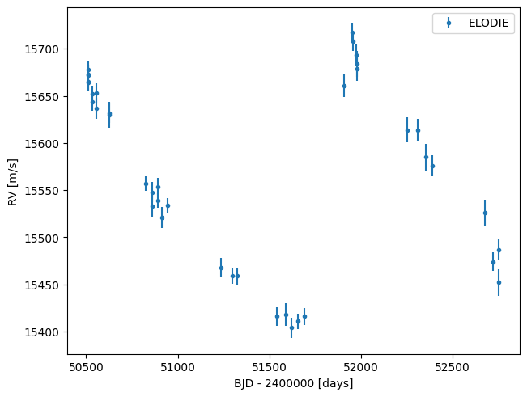
    


The combined data is also readily available


```python
from kima.examples.multi_instruments import HD106252_combined

HD106252_combined.plot()
```


    
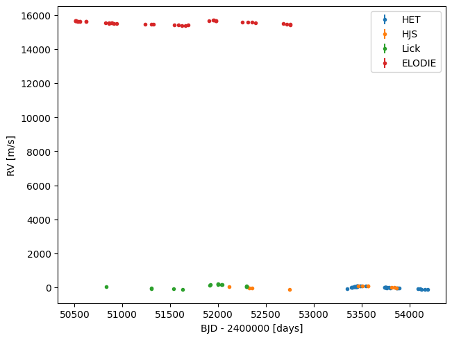
    


Note the clear offset between ELODIE data (in blue above) and the other
datasets. The average RV has been subtracted from the HET, HJS, and Lick data,
but not from ELODIE. This slightly convoluted situation is ideal to demonstrate
how **kima** deals with multiple instruments, especially with the default
priors.

### Simple model with default priors

We can now use one of the available models to analyse this dataset. We can
either create the model


```python
from kima import RVmodel

model = RVmodel(fix=False, npmax=1, data=HD106252_combined)
```

or import the `multi_instruments` function from the examples, which does the same
thing (but can also run the model directly)


```python
from kima.examples import multi_instruments
model_1 = multi_instruments(run=False)
```

Notice how we set the number of planets to be _free_, implicitly assigning to it
a uniform prior between 0 and 1 (by setting `npmax=1`).

This is all that is necessary to setup the data and model, and we are now ready
to run the analysis. Notice that we didn't explicitly assign any priors (except
for the number of planets). This means **kima** will use all the default priors.

Let's run the model for a few thousand steps and load the results


```python
model_2, res = multi_instruments(run=True, load=True, steps=1_000)
```

    # Seeding random number generators. First seed = 1774786221.
    # Generating 16 particles from the prior...done.
    # Sampling...
    # Creating level 1 with log likelihood = -41672699.602
    # Creating level 2 with log likelihood = -22160193.243
    # Creating level 3 with log likelihood = -12932226.1764
    # Creating level 4 with log likelihood = -7102489.76827
    # Creating level 5 with log likelihood = -4328483.50344
    # Creating level 6 with log likelihood = -2837473.84961
    # Creating level 7 with log likelihood = -1405544.29439
    # Creating level 8 with log likelihood = -694001.107688
    # Creating level 9 with log likelihood = -365390.575664
    # Creating level 10 with log likelihood = -243424.077566
    # Creating level 11 with log likelihood = -163717.581603
    # Creating level 12 with log likelihood = -113113.945542
    # Creating level 13 with log likelihood = -65736.8306782
    # Creating level 14 with log likelihood = -45029.607034
    # Saving particle to disk. N = 400.
    # Creating level 15 with log likelihood = -30918.3294418
    # Creating level 16 with log likelihood = -14790.9692475
    # Creating level 17 with log likelihood = -8536.42767302
    # Creating level 18 with log likelihood = -6591.00241089
    # Creating level 19 with log likelihood = -5153.53941592
    # Creating level 20 with log likelihood = -4261.88897482
    # Creating level 21 with log likelihood = -3544.49215641
    # Creating level 22 with log likelihood = -2918.62355424
    # Creating level 23 with log likelihood = -2407.15783565
    # Creating level 24 with log likelihood = -2011.67688725
    # Saving particle to disk. N = 800.
    # Creating level 25 with log likelihood = -1767.63022911
    # Creating level 26 with log likelihood = -1516.64458251
    # Creating level 27 with log likelihood = -1300.07516233
    # Took 7.155 seconds
    Loading files took 0.07 seconds
    log(Z) = -972.14
    Information = 30.17 nats
    BMD = 0.00
    Effective sample size = 1.0


Did we find HD106252 _b_?


```python
res.plot_posterior_np()
```

    Np probability ratios:  []


    
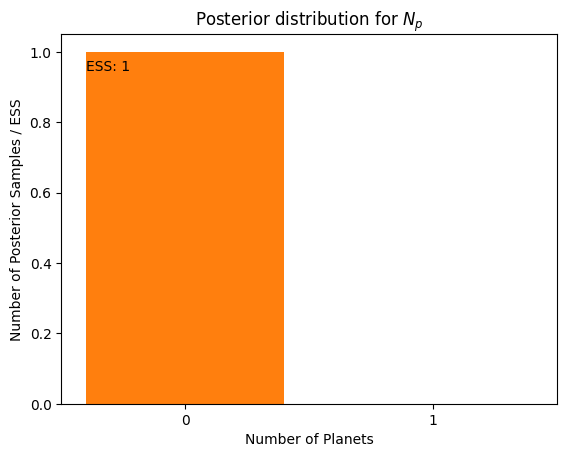
    


Yes! In fact, even though the $N_p$ parameter was free, all the samples have
$N_p=1$ because the posterior probability is so much higher than for $N_p=0$.
So we're pretty sure about this detection. How does the fit look?


```python
res.plot_random_samples()
```


    
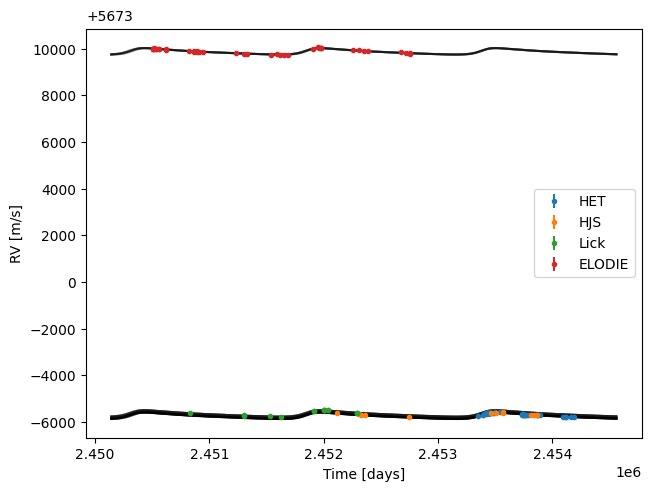
    


The `plot_random_samples` function just shows the Keplerian curves from a few
random posterior samples, together with the data. Note that the RV offsets for
each instrument are not subtracted from the data. This is on purpose: since
we're showing _several_ posterior samples (50 by default), there are actually
several values for the offsets. Zooming in on one particular dataset helps (note
the several blue curves):


```python
fig = res.plot_random_samples()
fig.axes[0].set_ylim(9600, 10200)
fig
```


    
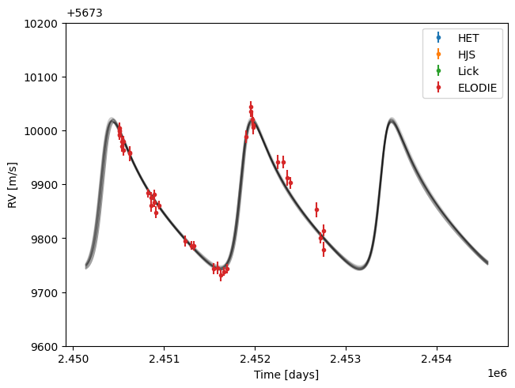
    


Looking at the posterior for the orbital period, semi-amplitude, and
eccentricity of the planet clearly shows that the default priors are a bit too wide


```python
res.plot_posterior_PKE(show_prior=True)
```

    (10000,) (10000,) (10000,)


    
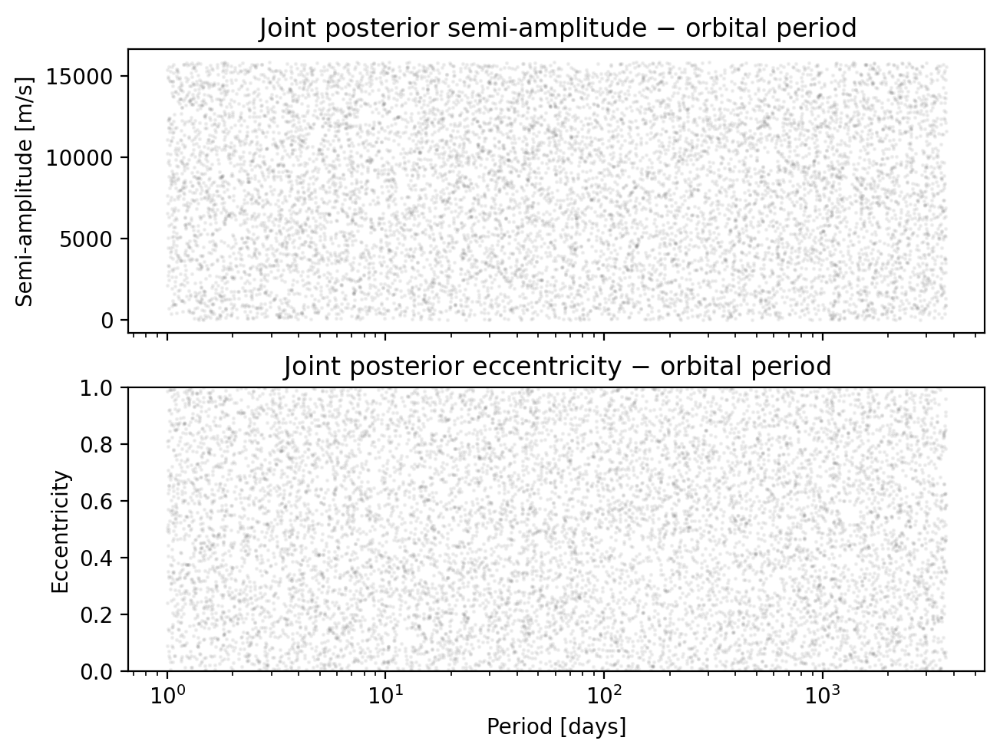
    


The situation is similar for the systemic velocity and for the RV offsets, as
evidenced in the plots below, where we might not even see the posterior!


```python
res.hist_vsys(show_prior=True)[0]
```


    
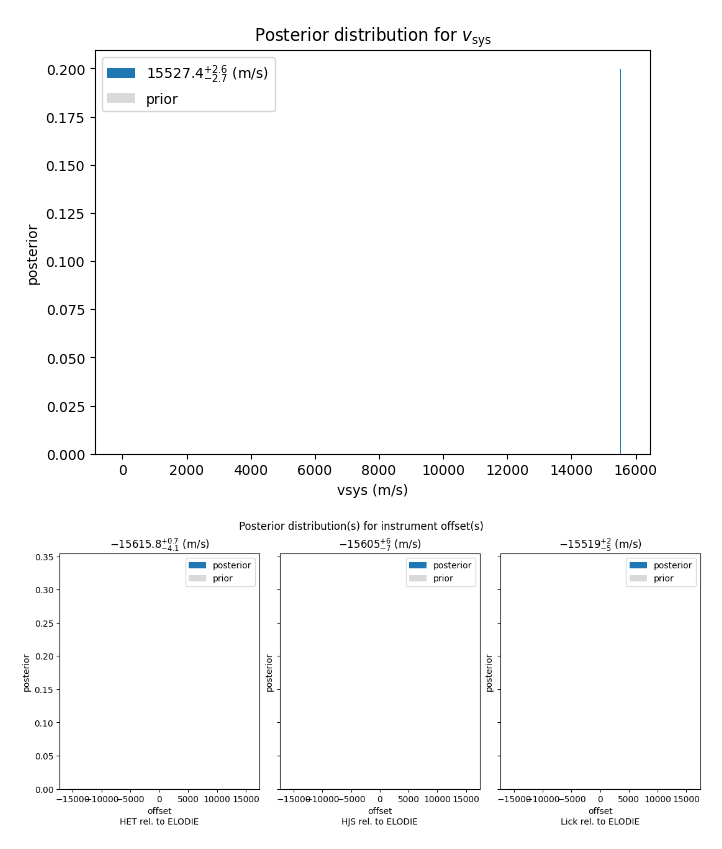
    


but they're there:


```python
res.hist_vsys()[0]
```


    
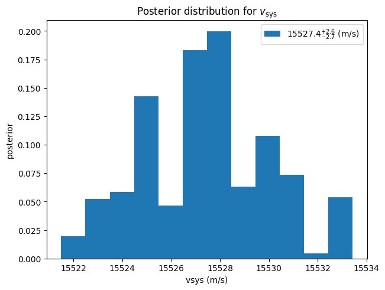
    


What we see here is that **kima** tries very hard to have default priors which
will be appropriate for every RV dataset. However, this does sometimes mean that
the priors are way too wide, which might hurt the performance of the sampler.

### Informative priors

These issues can be easily solved by setting slightly more informative priors for the RV offsets and some of the orbital parameters. We'll use a couple of helper functions available in `pykima.utils` to assign appropriate Gaussian priors.


```python
from kima.pykima.utils import (get_gaussian_prior_vsys, 
                               get_gaussian_priors_individual_offsets)
```


```python
model_2.Cprior = get_gaussian_prior_vsys(model_2.data, use_std=True)
print(model_2.Cprior)
```

    Gaussian(15580.5; 96.3933)


```python
model_2.individual_offset_prior = get_gaussian_priors_individual_offsets(model_2.data, use_std=True)
print(model_2.individual_offset_prior)
```

    [Gaussian(-15590.4; 59.0117), Gaussian(-15583.9; 61.2813), Gaussian(-15518.5; 102.095)]


and also set a narrower prior for the semi-amplitude


```python
model_2.conditional.Kprior = kima.distributions.Uniform(0, 500)
```

Let's run the model again using the new priors


```python
kima.run(model_2, steps=1000, num_threads=4, progress_bar=True)
```

    # Seeding random number generators. First seed = 1774786237.
    # Generating 4 particles from the prior...done.
    # Sampling...
    # level: 1 logL: -5272
# level: 2 logL: -4219
# level: 3 logL: -3803
# level: 4 logL: -3340
# level: 5 logL: -2635
# level: 6 logL: -2251
# level: 7 logL: -1859
# level: 8 logL: -1639
# level: 9 logL: -1428
# level: 10 logL: -1230
# level: 11 logL: -1044
# level: 12 logL: -920.5
# level: 13 logL: -870.5
# level: 14 logL: -771.8
# level: 15 logL: -721.9
# level: 16 logL: -694.5
# level: 17 logL: -678.7
# level: 18 logL: -667.4
# level: 19 logL: -656
# level: 20 logL: -648.9
# level: 21 logL: -643.3
# level: 22 logL: -640.3
# level: 23 logL: -635.6
# level: 24 logL: -621.6
    # Took 12.58 seconds


```python
res_1 = kima.load_results(model_2)
```

    Loading files took 0.05 seconds
    log(Z) = -614.91
    Information = 26.06 nats
    BMD = 0.01
    Effective sample size = 1.0


The priors for the systemic velocity and RV offsets are still relatively wide
but much more comparable to the posteriors


```python
res_1.hist_vsys(show_prior=True)[0]
```


    
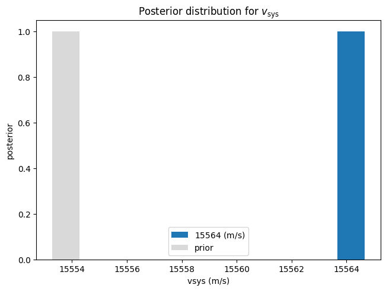
    


and for the orbital parameters


```python
res_1.plot_posterior_PKE(show_prior=True)
```

    (10000,) (10000,) (10000,)


    
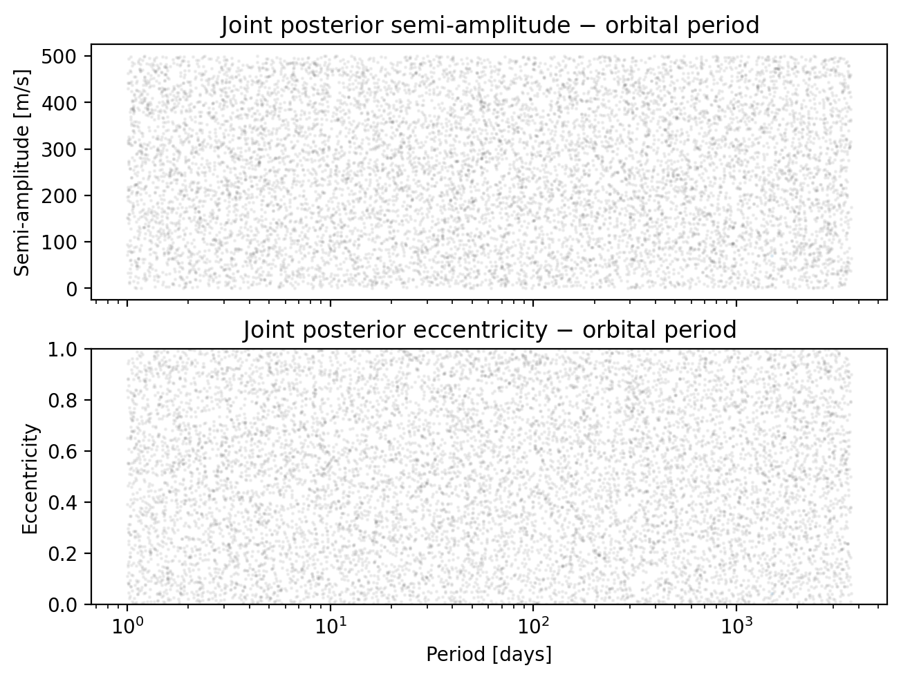
    


In any case, the orbital parameters of HD106252 _b_ are well recovered. The
maximum likelihood solution provides an excellent fit to the data.


```python
p = res_1.maximum_likelihood_sample()
res_1.phase_plot(p)
```

    Sample with the highest likelihood value  (logL = -588.84)
    -> might not be representative of the full posterior distribution
    
    jitter:
      [  0.          39.14219623  13.01921112 129.15214067  53.54946682]
    number of planets:  1
    orbital parameters:           P           K          M0           e           w 
                         1491.11205    70.21321     0.85408     0.04242     0.77033
    instrument offsets:  (relative to ELODIE) 
                         HET                   HJS                   Lick                 
                         -15572.264            -15552.082            -15553.770           
    vsys:  15554.80614134


    
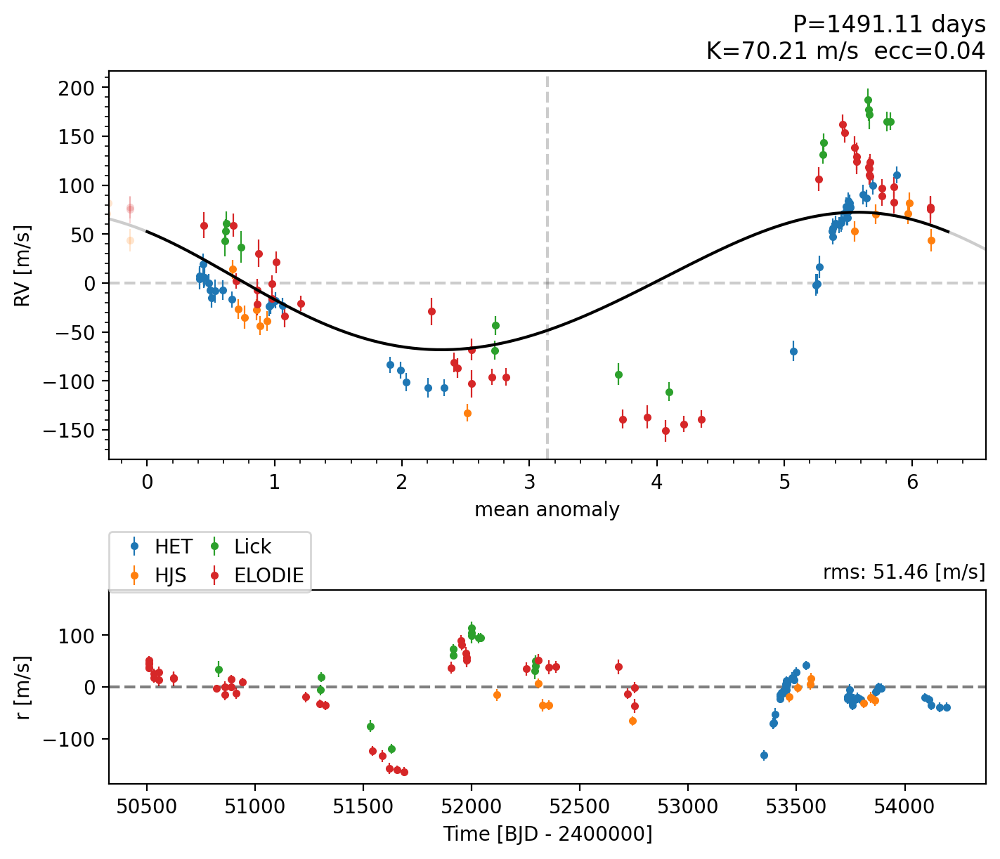
    


<div class="admonition warning">
    <div class="admonition-title">Warning</div>
    <p style="margin-top: 1em">
    In this example, we used some properties of the data to assign priors for a few parameters.
    Some Bayesians might not agree with this and, in general, they would be right.
    However, note in the figures above for the original analysis how there's just no posterior
    mass across very very wide regions of the prior. Upon realizing this, we tried to come up
    with more informative priors. That means that, in essence, we just performed a prior
    sensitivity analysis, and concluded that the posterior estimates for the parameters were consistent.
    </p>
    <p style="margin-top: 1em">
    Note also that this is <strong>very</strong> different from setting a prior for the orbital period
    based on a periodogram analysis, for example, which is almost never justified.
    </p>
</div>

---
#### marimo setup


```python
import marimo as mo
```
